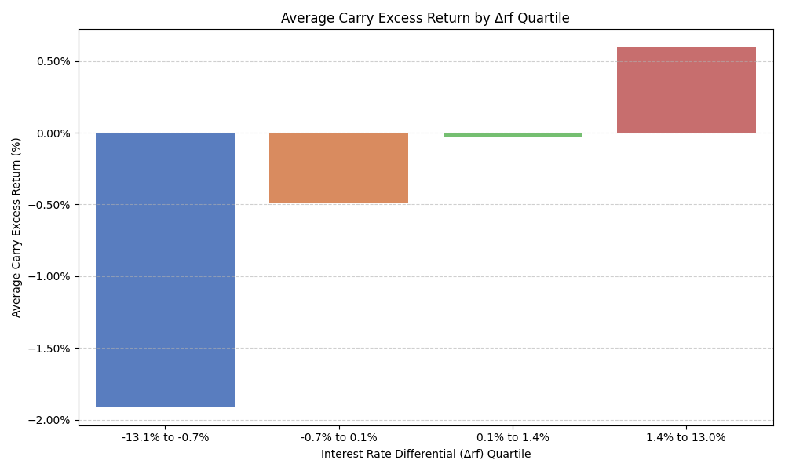

# Currency Hedging Evaluation  
#### Birju Patel

This study investigates whether hedging foreign currency exposure in international equity portfolios improves risk-adjusted returns. I use the [Jordà-Schularick-Taylor Macrohistory Database](https://www.macrohistory.net/data/), which contains more than a century of macro-financial data across 16 developed countries.

Two key papers motivate this work.

- **Boudoukh et al. (2015), “Risk Without Reward: The Case for Strategic FX Hedging”**  
  The authors argue that currency exposure contributes volatility to global portfolios without meaningful compensation in the form of return.
  
- **Lustig, Roussanov, and Verdelhan (2008), “Common Risk Factors in Currency Markets”**  
  They show that FX carry returns, driven by interest rate differentials, are explained by exposure to a common risk factor.

## Static Hedging

I begin by replicating the core empirical result: **currency-hedged portfolios offer similar average returns to unhedged ones but with less volatility**.

#### USD-Adjusted Excess Return Statistics

| Strategy   | Mean Return | Std Dev | Sample Size |
|------------|-------------|---------|-------------|
| Hedged     | 6.35%       | 22.24%  | 2203        |
| Unhedged   | 6.16%       | 24.96%  | 2203        |

#### Statistical Tests

| Test                                 | Statistic | p-Value | Conclusion                                          |
|--------------------------------------|-----------|---------|-----------------------------------------------------|
| Welch’s t-test (Mean: Hedged > Unhedged) | 0.274     | 0.392   | Fail to reject H₀ (not significantly different) |
| F-test (Variance: Hedged < Unhedged)    | 0.794     | <0.001  | Reject H₀ (hedged volatility is significantly lower) |

These results support a **default position of full FX hedging** for international equity exposure.

## Dynamic Hedging Strategy

However, hedging becomes expensive when the interest rate in the foreign country exceeds that of the U.S. To control for this, I evaluate a dynamic hedging rule.

**Hedge fully unless foreign rates exceed U.S. rates by more than a threshold. If so, hedge only a fraction of the currency exposure.**

This rule exploits the fact that returns on currency carry are positively correlated with the spread between the U.S. and foreign short-term interest rate.



I run a grid search over combinations of threshold and hedge ratio values to find the optimal parameters.

#### Sharpe Ratio Comparison

| Threshold | Hedge Ratio | Dynamic Sharpe | Static Sharpe | Sharpe Gain | t-Stat | p-Value |
|-----------|-------------|----------------|---------------|-------------|--------|---------|
| 1.0%      | 50%         | 0.293          | 0.286         | +0.007      | 1.67   | 0.047   |

The improvement is **small but statistically significant**, suggesting that FX exposure can be selectively accepted when the interest rate differential is favorable.

To see the results, first download this repository. Ensure that Python is installed on your machine. Then run the following command to install the required dependencies.

```bash
python -m pip install numpy pandas statsmodels matplotlib seaborn scipy
```

## Scripts
- `index.py` — Builds cumulative return indices (hedged, unhedged, dynamic)
- `hedged_vs_unhedged.py` — Performs mean and variance statistical comparisons
- `currency_carry.py` — Calculates FX carry and explores return drivers
- `optimal_params.py` — Runs a grid search to find optimal parameters for the dynamic hedging strategy
